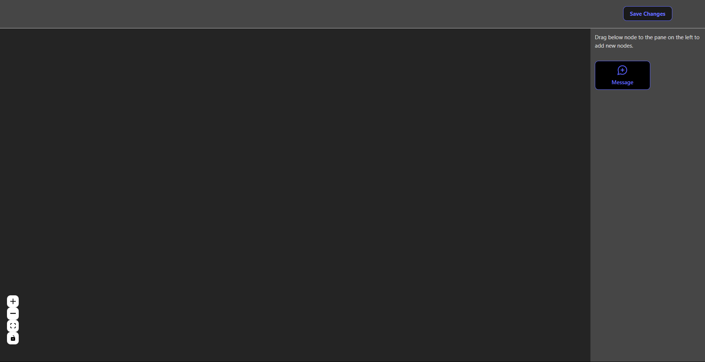
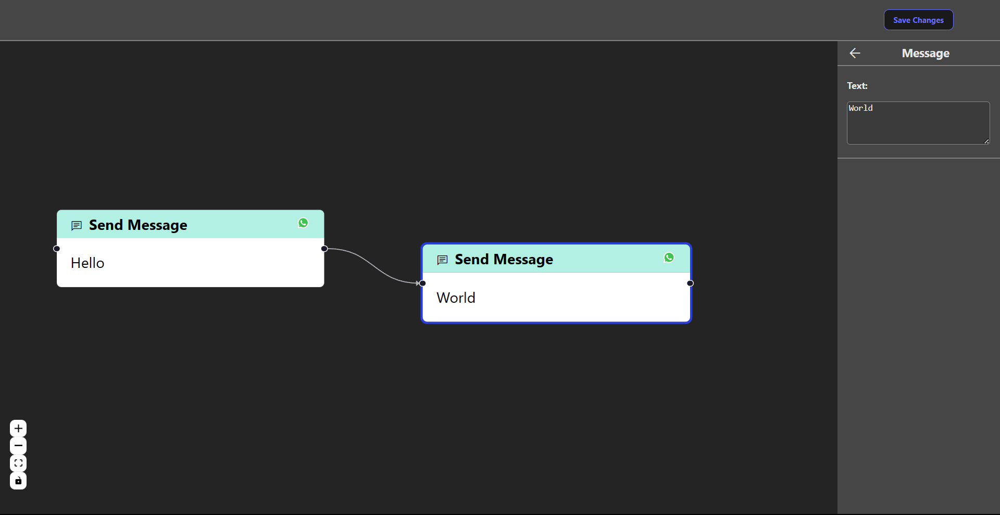

# Chatbot Flow Builder

## Live Demo: https://chatbot-flow-builder-beryl.vercel.app/

This Chatbot flow builder template provides a minimal setup to get up & running with a flow builder for creating & connecting multiple message nodes together to decide the order of execution.

Made with [React](http://reactjs.org) and [React Flow](https://reactflow.dev/).

Demo Images:

Currently, the following features are available:

- Our flow builder currently supports only one type of message (i.e Text Message) inside the Nodes panel but it is extensible.
- Source Handle connections are limited to one connection to make it easy to decide the order of execution of flow builder.
- Unlimited number of connections to the target Handle.
- Settings Panel will replace the Nodes Panel when a Node is selected. It has a text field to edit text of the selected Text Node.
- Currently we support only Dark Mode.

## Available Scripts

In the project directory, you can run:

### `npm start`

Runs the app in the development mode.\
Open [http://localhost:3000](http://localhost:3000) to view it in your browser.

The page will reload when you make changes.\
You may also see any lint errors in the console.

### `npm run build`

Builds the app for production to the `build` folder.\
It correctly bundles React in production mode and optimizes the build for the best performance.

The build is minified and the filenames include the hashes.\
Your app is ready to be deployed!

See the section about [deployment](https://facebook.github.io/create-react-app/docs/deployment) for more information.
